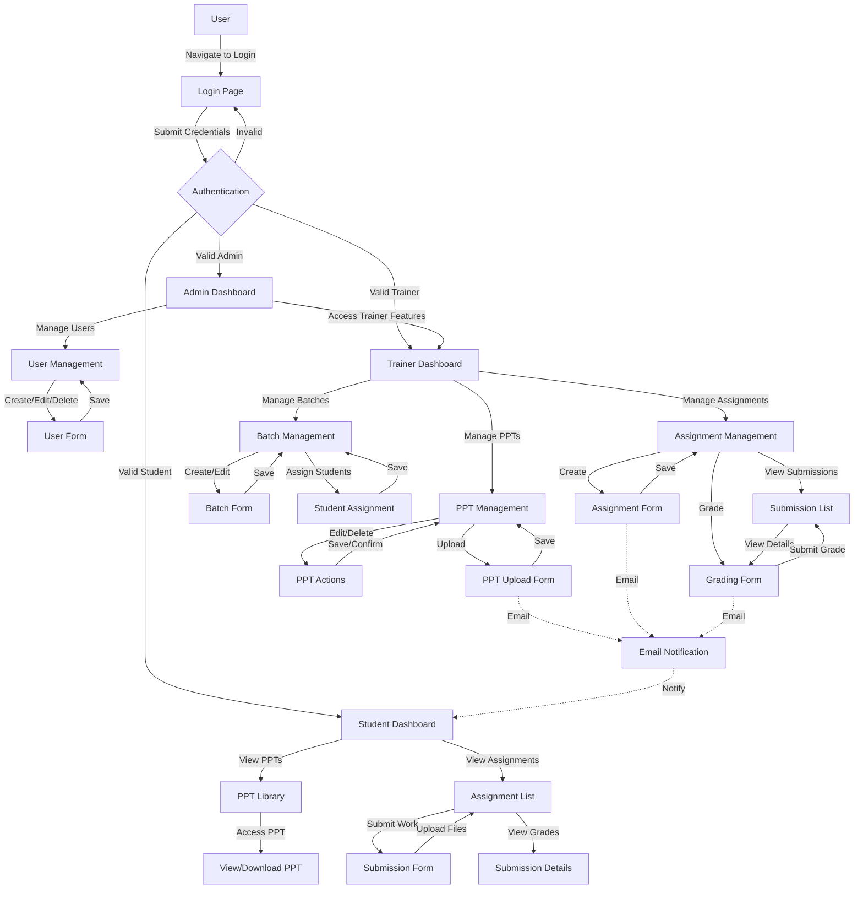

# ACADIGO

*A powerful, comprehensive web-based system for managing access to presentations and assignments with role-based permissions.*

## Team Members
- Aadi Joshi
- Nihit Shevade
- Varad Rathor
- Sharwil Hodgar

## Features

- **Multiple User Roles**: Admin, Trainer, and Student with appropriate permissions
- **Intuitive Dashboard**: Role-specific dashboards with quick access to all features
- **PPT Management**: Upload, organize, view, and track presentations
- **Assignment System**: Create assignments, set deadlines, submit solutions, and grade withfeedback
- **Batch Management**: Organize students into batches for streamlined content delivery
- **Access Control**: Fine-grained control over who can access which materials
- **Activity Tracking**: Comprehensive tracking of student access and engagement
- **Email Notifications**: Automatic alerts for deadlines, new uploads, and grading events
- **Dark Mode**: Built with modern UI and dark theme for reduced eye strain
- **Responsive Design**: Works seamlessly on desktop, tablet, and mobile devices
- **Advanced Analytics**: System-wide usage metrics, PPT views, download tracking, and userengagement statistics
- **Profile Management**: User profile customization with photo uploads and profile information
- **Resume Management**: Student resume/CV upload and tracking functionality
- **Visual Feedback System**: Trainers can provide both text and image-based feedback on submissions
- **Submission Timeliness Tracking**: System automatically tracks if assignments are submitted on time or late
- **System Debug Tools**: Administrative tools for system maintenance and troubleshooting
- **Security Settings**: Configurable security levels and access control mechanisms
- **File Upload Management**: Comprehensive file upload system with size limits and type restrictions

## User Roles and Permissions

### Admin
- Manage all users (create, edit, delete)
- Configure system settings and security parameters
- Access all trainer and student features
- View system-wide analytics and debug information
- Monitor system performance and usage statistics

### Trainer
- Create and manage batches
- Upload and manage PPTs
- Create assignments and set deadlines
- Grade student submissions with text and image feedback
- View student progress and engagement metrics
- Track student profiles and resume information

### Student
- View assigned PPTs and download learning materials
- Submit assignments before deadlines
- Receive grades and detailed feedback
- Track personal progress and submission history
- Manage personal profile and upload resume/CV
- View submission timeliness statistics

## User Flow Diagram



## Tech Stack


- **Frontend**: React, Vite, Tailwind CSS
- **Backend**: Node.js, Express, JWT Authentication, Bcrypt.js
- **Database**: MongoDB with Mongoose
- **Storage**: Supabase Storage for files
- **Email**: Nodemailer for notifications
- **Deployment**: Hosted both /frontend and /backend on Railway

## Project Structure

```
ppt-access-control/
├── frontend/               # React frontend application
│   ├── src/                # Source files
│   │   ├── components/     # Reusable components
│   │   ├── context/        # React context (auth, etc.)
│   │   ├── hooks/          # Custom React hooks
│   │   ├── pages/          # Page components
│   │   └── services/       # API service calls
│   └── public/             # Static files
│
└── backend/                # Node.js backend API
    ├── controllers/        # Request handlers
    ├── middleware/         # Express middleware
    ├── models/             # Mongoose models
    ├── routes/             # API routes
    └── utils/              # Utility functions
```
