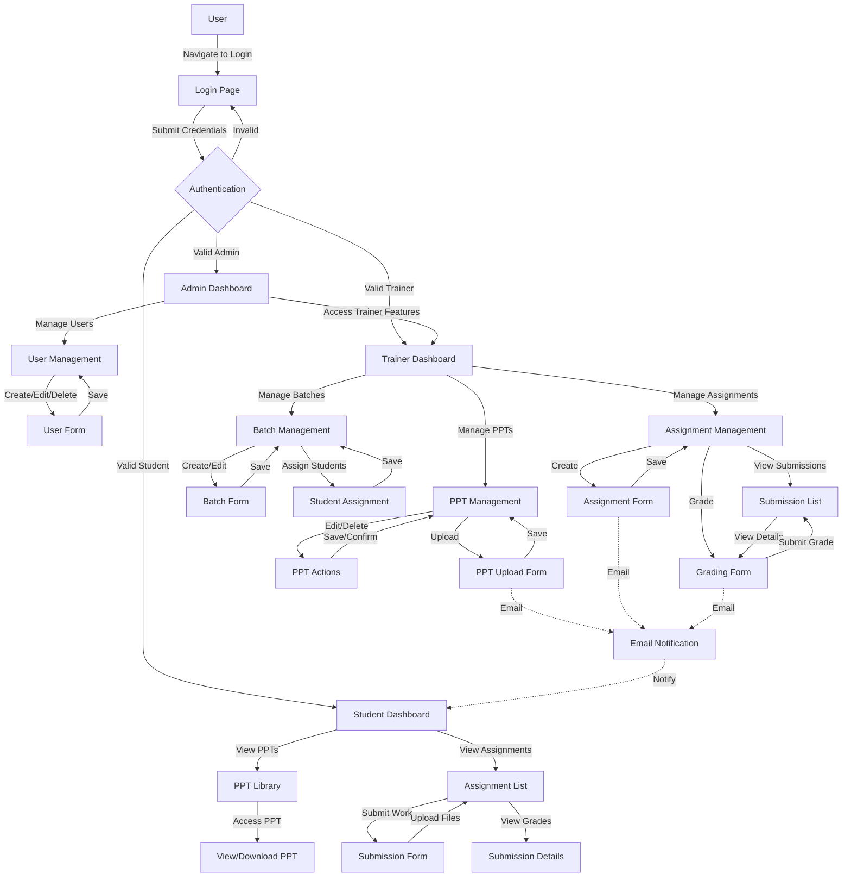

# 🚀 PPT Access Control System


*A powerful, comprehensive web-based system for managing access to presentations and assignments with role-based permissions.*

## ✨ Features

- **🔐 Multiple User Roles**: Admin, Trainer, and Student with appropriate permissions
- **📊 Intuitive Dashboard**: Role-specific dashboards with quick access to all features
- **📑 PPT Management**: Upload, organize, view, and track presentations
- **📝 Assignment System**: Create assignments, set deadlines, submit solutions, and grade with feedback
- **👥 Batch Management**: Organize students into batches for streamlined content delivery
- **📌 Access Control**: Fine-grained control over who can access which materials
- **📊 Activity Tracking**: Comprehensive tracking of student access and engagement
- **📧 Email Notifications**: Automatic alerts for deadlines, new uploads, and grading events
- **🌙 Dark Mode**: Built with modern UI and dark theme for reduced eye strain
- **📱 Responsive Design**: Works seamlessly on desktop, tablet, and mobile devices

## 🚀 Getting Started

### Prerequisites

- Node.js (v14+)
- MongoDB (local or Atlas cloud)
- Firebase account (for Storage)
- Email service credentials (for notifications)

### Installation

1. Clone the repository
   ```bash
   git clone https://github.com/yourusername/ppt-access-control.git
   cd ppt-access-control
   ```

2. Install dependencies for both frontend and backend
   ```bash
   cd frontend
   npm install
   cd ../backend
   npm install
   ```

3. Set up environment variables
   - Copy `.env.example` to `.env` in both frontend and backend directories
   - Update the variables with your configurations

4. Start the development servers
   - Backend: `npm run dev` (from the backend directory)
   - Frontend: `npm run dev` (from the frontend directory)

5. Access the application at `http://localhost:5173`

## 🧑‍💻 User Roles and Permissions

### 👑 Admin
- Manage all users (create, edit, delete)
- Configure system settings
- Access all trainer and student features
- View system-wide analytics

### 👨‍🏫 Trainer
- Create and manage batches
- Upload and manage PPTs
- Create assignments and set deadlines
- Grade student submissions
- View student progress and engagement metrics

### 👨‍🎓 Student
- View assigned PPTs
- Download learning materials
- Submit assignments before deadlines
- Receive grades and feedback
- Track personal progress

## 🔄 User Flow Diagram



## 📊 System Architecture

The application is built with a modern tech stack following a client-server architecture:

1. **Frontend (Client)**
   - React for UI components and state management
   - React Router for navigation
   - Tailwind CSS for styling
   - Headless UI for accessible components
   - Axios for API communication

2. **Backend (Server)**
   - Express.js RESTful API
   - JWT authentication
   - Role-based access control
   - Rate limiting for API protection

3. **Database**
   - MongoDB for data storage
   - Mongoose for data modeling

4. **External Services**
   - Firebase Storage for file storage
   - Nodemailer for email notifications

## 🧪 Testing

Run the test suite to ensure everything is working correctly:

```bash
cd backend
npm test

cd ../frontend
npm test
```

## 🚢 Deployment

### Backend Deployment
1. Set up environment variables in your hosting platform
2. Deploy the backend to your preferred Node.js hosting (Heroku, Railway, DigitalOcean, etc.)
3. Ensure MongoDB connection is properly configured

### Frontend Deployment
1. Update the API URL in the frontend environment
2. Build the frontend: `npm run build`
3. Deploy the build folder to a static hosting service (Vercel, Netlify, etc.)

## 🛠️ Tech Stack

- **Frontend**: React, Vite, Tailwind CSS, Headless UI, React Router
- **Backend**: Node.js, Express, JWT Authentication
- **Database**: MongoDB with Mongoose
- **Storage**: Firebase Storage for files
- **Email**: Nodemailer for notifications
- **Deployment**: Ready for Vercel, Railway, or any modern hosting platform

## 🗂️ Project Structure

```
ppt-access-control/
├── frontend/               # React frontend application
│   ├── src/                # Source files
│   │   ├── components/     # Reusable components
│   │   ├── context/        # React context (auth, etc.)
│   │   ├── hooks/          # Custom React hooks
│   │   ├── pages/          # Page components
│   │   └── services/       # API service calls
│   └── public/             # Static files
│
└── backend/                # Node.js backend API
    ├── controllers/        # Request handlers
    ├── middleware/         # Express middleware
    ├── models/             # Mongoose models
    ├── routes/             # API routes
    └── utils/              # Utility functions
```
